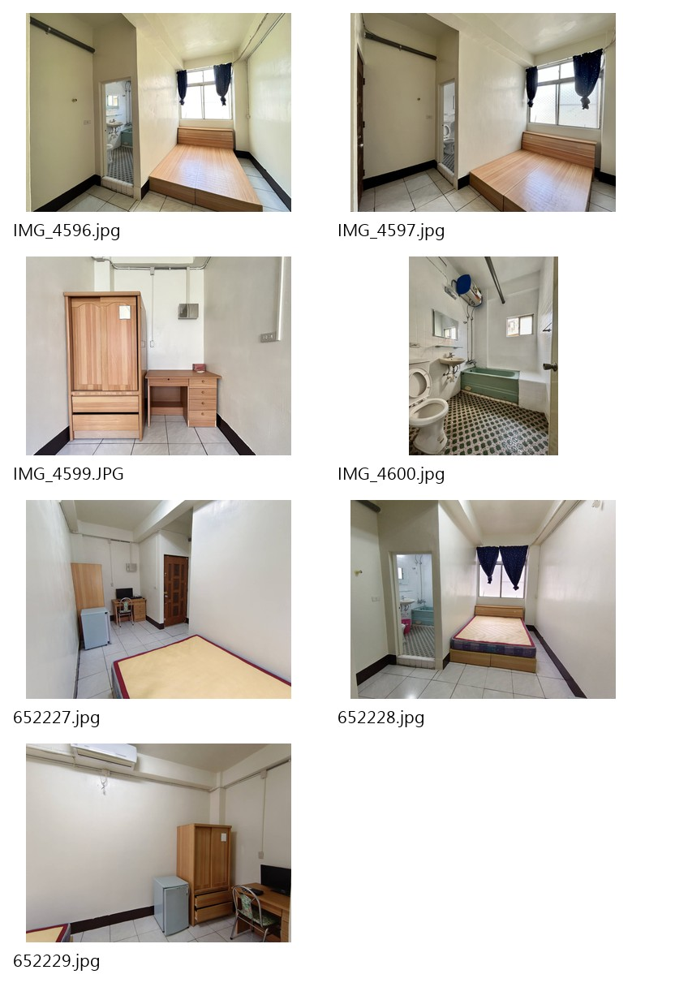
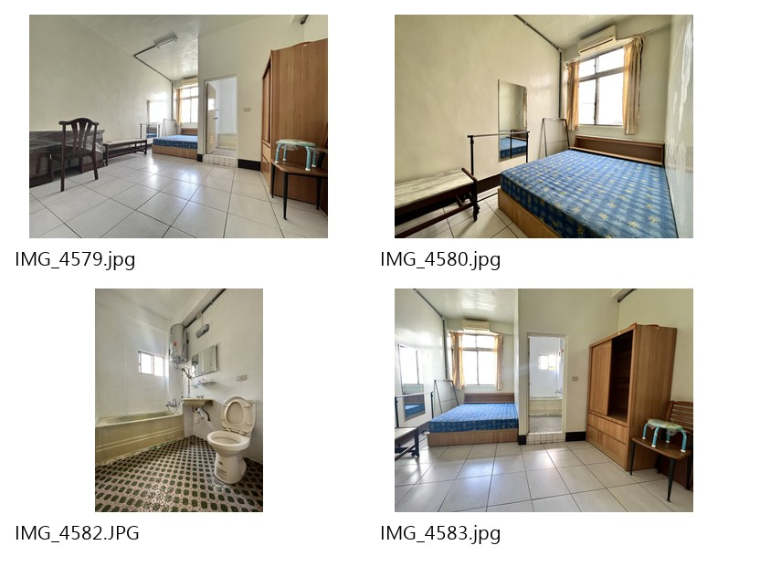
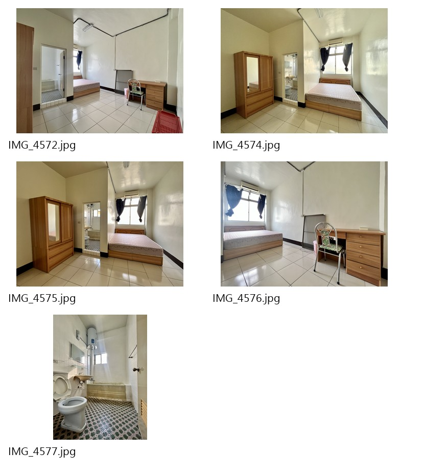
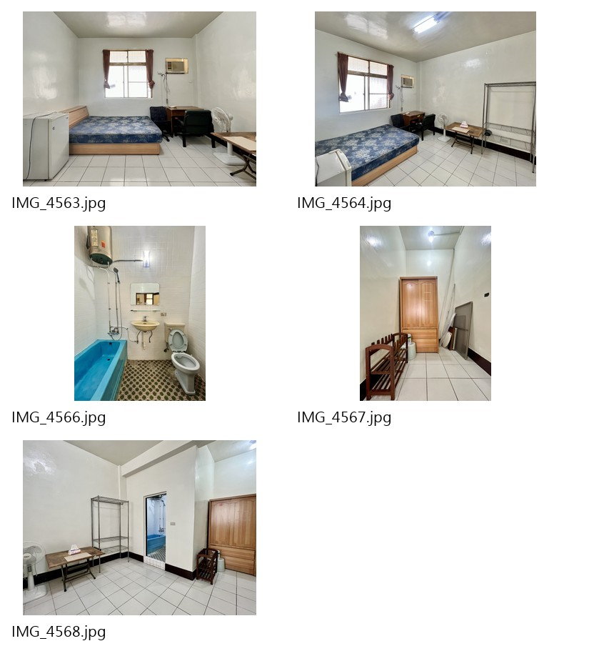
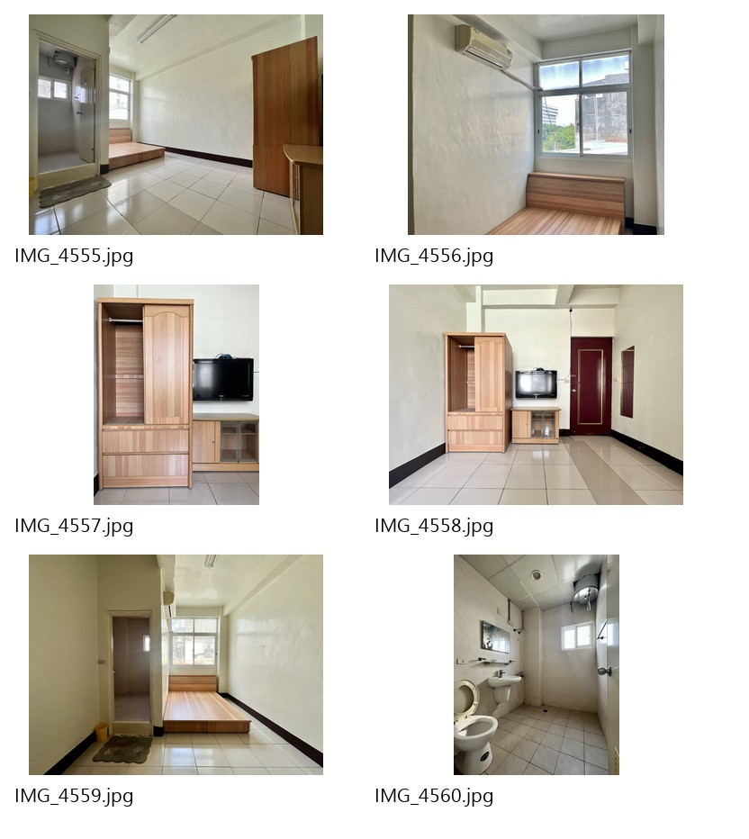
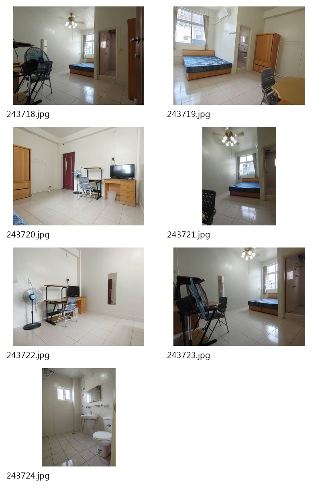
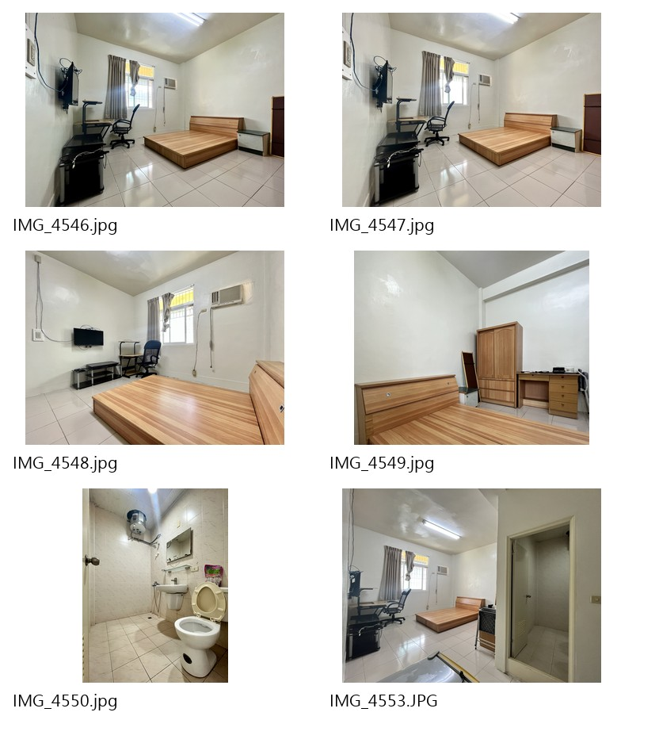

# 四維三路59號｜格局照片比對紀錄 V1.2

本文件保留照片中可客觀看見的空間線索。**房型分組以最新人工確認（2026-10-06）為準；本文件舊版的視覺候選結論已由使用者確認結果取代，不再用來推定房型。**家具差異不作為格局判斷；照片不可跨房號作為現況照。

> **V1.2 更新（2026-10-06 人工確認）：**建物總房數20間＝目前出租17間＋目前不出租3間（303、306、506）；604不存在。實際地址為四維三路59號。每間房都有桌椅。

## 最新人工確認的格局群

目前共12個房型／格局群、17間出租房（建物共20間，303、306、506目前不出租；604不存在）：

1. 301／501
2. 302／502
3. 305／505
4. 307／507
5. 308／508
6. 503（獨立；503≠507、503≠303）
7. 601（六樓獨立）
8. 602（六樓獨立）
9. 603（六樓獨立）
10. 605（六樓獨立）
11. 606（六樓獨立）
12. 607（六樓獨立）

六樓601、602、603、605、606、607彼此皆為不同格局，605≠606；六樓與三、五樓格局不同。508與305／505格局不同。上述分組不代表可以混用照片；房間照片仍只能標為其人工確認的房號。

## 照片中可見內容（只作影像記錄）

| 照片組 | 清單照片數 | 照片可見特徵摘要 |
| --- | ---: | --- |
| 503 | 7 | 可見室內空間、窗、床／床台、家具家電及衛浴；不再以照片相似度與507合併。 |
| 505 | 4 | 可見房間、窗、床、衣櫃、桌椅、冷氣及浴缸衛浴；照片只屬505，不作305現況照。 |
| 507 | 5 | 可見房間、窗、床、衣櫃、桌椅及浴缸衛浴；照片只屬507，不作307現況照。 |
| 508 | 5 | 可見較寬的室內空間、床、窗、冷氣、冰箱、桌椅／架子及浴缸衛浴；格局獨立於305／505。 |
| 603 | 6 | 可見室內空間、窗、床台、衣櫃／電視櫃、冷氣及淋浴衛浴；照片只屬603。 |
| 605 | 7 | 可見房間、窗、床、衣櫃、桌椅、吊扇及衛浴；照片只屬605。 |
| 606 | 6 | 可見床台、窗、窗型冷氣、電視、衣櫃、桌椅及淋浴衛浴；照片只屬606。 |

照片細節與完整檔名請參考 [siwei-room-photo-map-v1.md](siwei-room-photo-map-v1.md)。上述可見內容只描述畫面，不代表逐房目前設備狀態。

## 照片檢視

## 照片限制與仍缺資料

- 目前沒有直接照片的出租房號：302、305、307、308、601、602、607。目前不出租的303、306、506也無已整理直接照片。相同格局的房間照片仍不可代替其現況照。
- 303、306、506目前不出租，暫不納入目前出租房源；303格局已確認不同於503，不需要再作格局推測。
- 只有已由人工指定歸屬的照片才能標示對應房號。照片視覺及檔名不自行改變歸屬。
- 照片沒有量測尺寸，不能由此產生坪數或尺寸資料。
- 公共區域照片另列於照片對照清單，不併入任何房型照片。

本文件不再列照片推論待確認格局；目前12組分群以最新人工確認為準。
