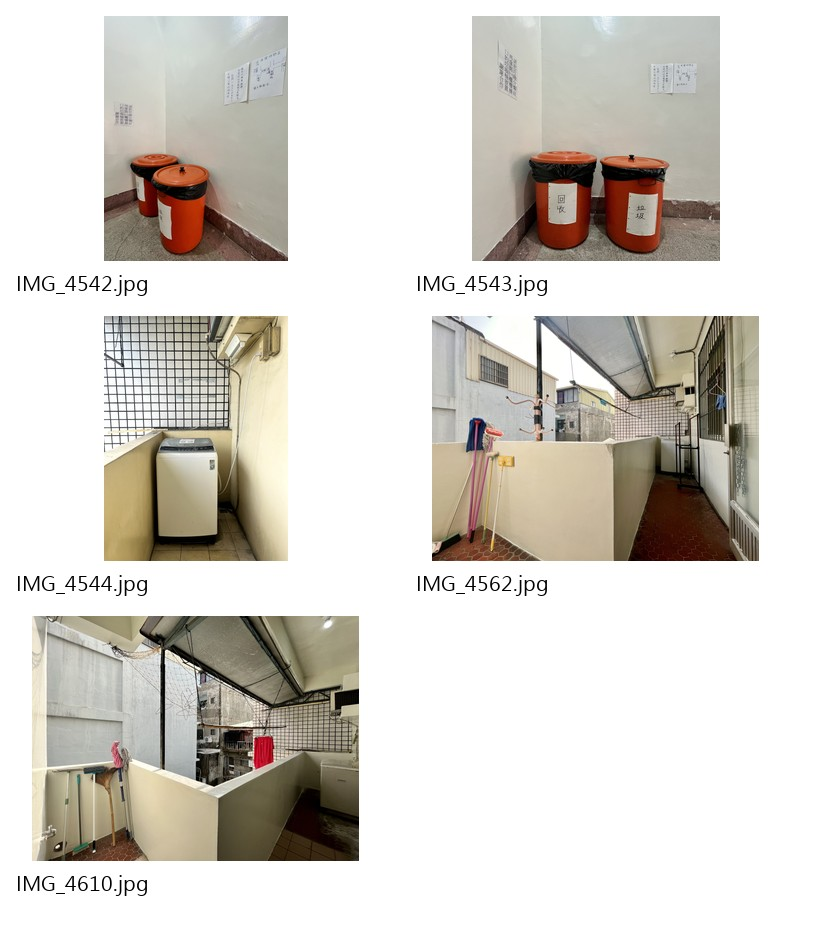

# 四維三路 59 號｜房間照片對照清單 V1.2

本文件依使用者指定的房號分組整理照片。**房號分組來自使用者明確指定，不是我從檔名自行推斷；照片可見內容只作客觀描述，不據此建立或推定格局群。**公共區域獨立列出，不歸屬房號。

> **V1.2 更新（2026-10-06 人工確認）：**建物總房數20間＝目前出租17間＋目前不出租3間（303、306、506）；604不存在。實際地址為四維三路59號。每間房都有桌椅。

照片對照縮圖位於 `docs/siwei-photo-comparison-v1/`，是由原始照片製作的檢視副本。NAS 原始照片未修改、移動、重新命名或刪除。

## 一、使用者指定房號照片組

### 503

- 原始來源資料夾：
  - `D:\PHOTO\個案照片-41四維三路\503\`
  - `D:\PHOTO\個案照片-41四維三路\四維503照片更新\`
- 本清單收錄 7 張：
  - `D:\PHOTO\個案照片-41四維三路\503\IMG_4596.jpg`
  - `D:\PHOTO\個案照片-41四維三路\503\IMG_4597.jpg`
  - `D:\PHOTO\個案照片-41四維三路\503\IMG_4599.JPG`
  - `D:\PHOTO\個案照片-41四維三路\503\IMG_4600.jpg`
  - `D:\PHOTO\個案照片-41四維三路\四維503照片更新\652227.jpg`
  - `D:\PHOTO\個案照片-41四維三路\四維503照片更新\652228.jpg`
  - `D:\PHOTO\個案照片-41四維三路\四維503照片更新\652229.jpg`
- 缺號／缺照片：指定 `IMG_4596～IMG_4600` 範圍內沒有 `IMG_4598.jpg`；`IMG_4599` 的實際副檔名為 `.JPG`。來源另有 `IMG_4595.jpg`，未列入本次指定組。這些是檔案序號盤點結果，不代表應有照片缺失。
- 照片可見：數張房間全景可看到較長的室內空間、窗戶及床／床台；另有衣櫃、書桌、冰箱、電視等家具家電畫面。衛浴照片可見浴缸、洗手台、馬桶及窗戶。照片組中不同拍攝角度的配置不完全相同；本表不據此判斷是否同一房間或不同格局。
- 房內可見設備／家具：冷氣（部分照片）、電視、冰箱、衣櫃、書桌椅、床／床台。
- 衛浴可見：浴缸、洗手台、馬桶、窗戶。

### 505

- 原始來源資料夾：`D:\PHOTO\個案照片-41四維三路\505\`
- 照片數量：4 張。
- 原始檔名：`IMG_4579.jpg`、`IMG_4580.jpg`、`IMG_4582.JPG`、`IMG_4583.jpg`。
- 缺號／缺照片：目前資料夾未找到 `IMG_4581`；只記錄序號空缺，不推定原本應有該照片。
- 照片可見：房間全景、窗戶、床、衣櫃及桌椅；照片中可見冷氣。衛浴畫面可見浴缸、洗手台與馬桶。
- 房內可見設備／家具：床、衣櫃、桌椅、冷氣。
- 衛浴可見：浴缸、洗手台、馬桶。

### 507

- 原始來源資料夾：`D:\PHOTO\個案照片-41四維三路\507\`
- 照片數量：5 張。
- 原始檔名：`IMG_4572.jpg`、`IMG_4574.jpg`、`IMG_4575.jpg`、`IMG_4576.jpg`、`IMG_4577.jpg`。
- 缺號／缺照片：資料夾中未找到 `IMG_4573`；其餘本清單列出的檔案存在。序號空缺不代表原本應有照片。
- 照片可見：房間、窗戶、床、衣櫃、桌椅及衛浴入口；衛浴照片可見浴缸、洗手台、馬桶及熱水器。
- 房內可見設備／家具：床、衣櫃、書桌／桌椅。
- 衛浴可見：浴缸、洗手台、馬桶、熱水器。

### 508

- 原始來源資料夾：`D:\PHOTO\個案照片-41四維三路\508\`
- 照片數量：5 張。
- 原始檔名：`IMG_4563.jpg`、`IMG_4564.jpg`、`IMG_4566.jpg`、`IMG_4567.jpg`、`IMG_4568.jpg`。
- 缺號／缺照片：資料夾中未找到 `IMG_4565`；其餘本清單列出的檔案存在。序號空缺不代表原本應有照片。
- 照片可見：窗戶、床、冷氣、冰箱、桌椅、衣櫃及金屬層架／架子。衛浴照片可見藍色浴缸、洗手台、馬桶及熱水器。
- 房內可見設備／家具：床、冷氣、冰箱、桌椅、衣櫃、金屬架。
- 衛浴可見：浴缸、洗手台、馬桶、熱水器。

### 603

- 原始來源資料夾：`D:\PHOTO\個案照片-41四維三路\603\`
- 照片數量：6 張。
- 原始檔名：`IMG_4555.jpg`、`IMG_4556.jpg`、`IMG_4557.jpg`、`IMG_4558.jpg`、`IMG_4559.jpg`、`IMG_4560.jpg`。
- 缺號／缺照片：清單序號連續，未見缺號。
- 照片可見：較長的室內視角、窗戶、床台、衣櫃及電視櫃；其中照片可見冷氣。衛浴照片可見洗手台、馬桶及淋浴設備。
- 房內可見設備／家具：床台、衣櫃、電視／電視櫃、冷氣。
- 衛浴可見：洗手台、馬桶、淋浴設備。

### 605

- 原始來源資料夾：`D:\PHOTO\個案照片-41四維三路\四維605\`
- 照片數量：7 張。
- 原始檔名：`243718.jpg`、`243719.jpg`、`243720.jpg`、`243721.jpg`、`243722.jpg`、`243723.jpg`、`243724.jpg`。
- 缺號／缺照片：清單序號連續，未見缺號。
- 照片可見：床、窗戶、衣櫃、桌椅及吊扇；另有衛浴空間照片。
- 房內可見設備／家具：床、衣櫃、桌椅、吊扇。
- 衛浴可見：洗手台、馬桶及淋浴設備；照片中未清楚看到浴缸。

### 606

- 原始來源資料夾：`D:\PHOTO\個案照片-41四維三路\606\`
- 照片數量：6 張。
- 原始檔名：`IMG_4546.jpg`、`IMG_4547.jpg`、`IMG_4548.jpg`、`IMG_4549.jpg`、`IMG_4550.jpg`、`IMG_4553.JPG`。
- 缺號／缺照片：本清單列出的 6 張皆存在；在 4546～4553 的編號範圍內未找到 4551、4552。這只是序號空缺，不代表原本應有照片。
- 照片可見：床台、窗戶、窗型冷氣、電視、衣櫃及桌椅；另有衛浴入口及室內照片。
- 房內可見設備／家具：床台、窗型冷氣、電視、衣櫃、桌椅。
- 衛浴可見：洗手台、馬桶、熱水器及淋浴空間。

## 二、公共區域照片（不歸屬房號）

- 原始來源資料夾：`D:\PHOTO\個案照片-41四維三路\公共區域\`
- 照片數量：5 張。
- 原始檔名：`IMG_4542.jpg`、`IMG_4543.jpg`、`IMG_4544.jpg`、`IMG_4562.jpg`、`IMG_4610.jpg`。
- 照片可見：兩個紅色桶／容器；一台上掀式洗衣機位於格柵旁；另有帶遮棚的公共陽台／走道空間及欄牆。只描述照片可見物，不據此確認用途、設備狀態或使用規則。

## 三、最新確認的完整房號與照片狀態

本案建物共20間房。目前出租房號共17間：301、302、305、307、308、501、502、503、505、507、508、601、602、603、605、606、607。目前不出租房號共3間：303、306、506，暫不納入出租房源。604不存在。

| 房號 | 已整理的直接照片數 | 備註 |
| --- | ---: | --- |
| 301 | 6 | 僅代表301。 |
| 302 | 0 | 不以502照片當作302現況照。 |
| 305 | 0 | 雖與505同格局，505照片仍只屬505。 |
| 307 | 0 | 不以507照片當作307現況照。 |
| 308 | 0 | 不以508照片當作308現況照。 |
| 501 | 7 | 僅代表501。 |
| 502 | 5 | 僅代表502。 |
| 503 | 7 | 僅代表503。（`503\IMG_4595.jpg` 未列入，待確認） |
| 505 | 4 | 僅代表505。 |
| 507 | 5 | 僅代表507。 |
| 508 | 5 | 僅代表508。 |
| 601 | 0 | 尚無直接照片。 |
| 602 | 0 | 尚無直接照片。 |
| 603 | 6 | 僅代表603。 |
| 605 | 7 | 僅代表605。 |
| 606 | 6 | 僅代表606。 |
| 607 | 0 | 尚無直接照片。 |
| 303 | 0 | 目前不出租；暫不納入出租房源。 |
| 306 | 0 | 目前不出租；暫不納入出租房源。 |
| 506 | 0 | 目前不出租；暫不納入出租房源。 |

## 四、目前待確認

- **直接照片缺口：**出租房 302、305、307、308、601、602、607 目前沒有已整理的直接照片；目前不出租的 303、306、506 也無已整理直接照片。目前無建物外觀及出入口照片。
- **照片用途：**照片只能標示於人工確認的實際房間。即使格局相同，也不能把同格局另一房的照片當成該房現況照。
- **照片現況：**照片呈現拍攝當時畫面，不證明房間目前屋況或設備仍相同。
- **公共區域使用規則：**公共區照片可見洗衣機及遮棚空間，但可用狀態、收費與規則另待確認。
- **檔號空缺與多餘檔案：**503 的 IMG_4598、505 的 IMG_4581、507 的 IMG_4573、508 的 IMG_4565，以及606的 IMG_4551／IMG_4552 未在相應照片資料夾找到（空號不等於原本應有照片）；`503\IMG_4595.jpg` 在資料夾中但未列入 503 收錄組，是否列入待確認。

格局群已依最新人工確認更新於 [siwei-room-type-proposal-v1.md](siwei-room-type-proposal-v1.md)。本照片表不再對格局關係提出推測。